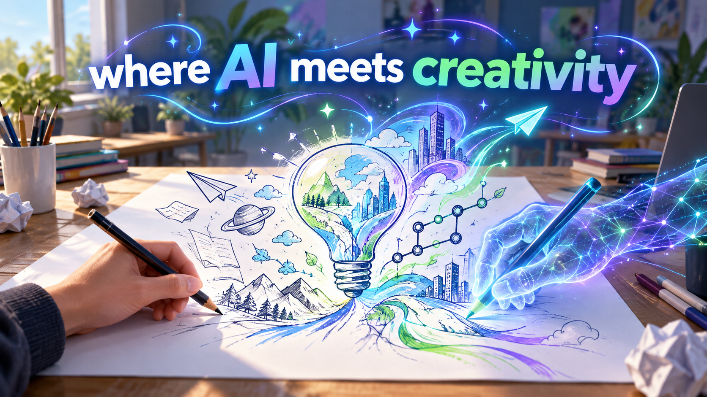

# Welcome to E26-AI01-09

## 🎯 팀 슬로건

> Where AI Meets Creativity.

## 🖼️ 팀 포스터

<div class="poster"></div>

<p align="center" class="poster-caption"><sub>AI01 9팀, 「Where AI Meets Creativity」(2026). 출처: 생성형 AI로 제작</sub></p>

***

## 1️⃣ 팀원 소개

| **이름** | **전공** | **관심사** |
| --- | --- | --- |
| **파노드** | 인공지능학부 | LLM, VLM, 취업 |
| **김나연** | 인공지능학부 | 인공지능, 알고리즘 |
| **박준우** | 인공지능학부 | 백엔드,프론트엔드 |


유레카프로젝트 팀 생성을 축하합니다.
팀의 제목과 슬로건, 팀원의 이름 및 관심사를 변경하세요.

### 팀 소개

인공지능을 통해 새로운 가능성을 탐구하는 9팀입니다. 우리만의 아이디어와 창의력으로 미래를 직접 만들어갑니다.
***

## 2️⃣ 공통된 관심사 : 여행, 백엔드, 인공지능

***

## 3️⃣ 한학기 동안의 활동 내역 

- 기관/부서 인터뷰 ✔️  

- 현장 탐방 ✔️  

- 멘토링 ✔️  
  - 내 지도 교수 함게 만나기
  - 대학원 방문 및 선배 만나기

- 프로젝트 진행 ✔️  
  - 과거에 사람들이 상상한 미래
   - **Team mission 1: 과거 사례 4분류 및 근거 작성**  
    실현된 기술
    ```
    전기 자동차, 태양열을 이용한 집, 로봇 청소기

    근거:
    - 전기 자동차: 여러 완성차 회사가 양산하게 되었고, 도로에서 흔히 볼 수 있을 만큼 대중화되었다.
    - 태양열을 이용한 집: 지붕 태양광 패널, 건물 일체형 태양광 등으로 주택에서 실제 전기를 만들어 쓰게 되었다.
    - 로봇 청소기: 스스로 집안을 돌아다니며 청소하는 가전으로 일반 가정에 널리 보급되었다.
    ```
    
    아직 미실현
    ```
    달나라 여행

    근거:
    - 우주비행사가 달에 간 적은 있었지만, 일반인이 여행으로 달에 가는 서비스는 아직 나오지 않았다.
    - 민간 우주여행도 지구 궤도 근처까지가 한계였고, 비용과 안전 문제로 대중화되지 못했다.
    ```
    
    일부 실현
    ```
    움직이는 도로

    근거:
    - 공항이나 지하철역의 무빙워크처럼 짧은 구간에서는 실현되었다.
    - 하지만 그림처럼 도시의 도로 전체가 움직여 사람을 실어 나르는 형태는 실현되지 않았다.
    ```
    
    방향 전환
    ```
    소형TV

    근거:
    - 그림은 들고 다니며 보는 작은 TV 기기를 상상했다.
    - 실제로는 TV 기기가 작아진 것이 아니라 스마트폰으로 방송과 영상을 보는 방식으로 바뀌었다.
    - 상상한 목적(언제 어디서나 영상 시청)은 이루어졌지만, 다른 기술로 실현되었다.
    ```
    ---

## WEEK 02 팀 미션 결과물

| 단계 | 내용 |
|---|---|
| **STEP 01. 문제 정의** | 다음 수업까지 30분～1시간이 남은 학부생은 점심 피크 시간(12～13시)에 학생식당의 대기 시간을 가 보기 전에는 알 수 없어, 줄을 보고 되돌아오며 10～15분을 허비하거나 식사를 거른다. 출발 전에 예상 대기 시간을 알 수 있다면 남은 시간 안에 학식을 먹을지, 다른 곳으로 갈지 바로 결정할 수 있다. |
| **STEP 02. 주요 프롬프트** | ① 문제를 사용자/상황/문제/기대효과로 추상화해 달라고 요청<br>② 검증하지 않은 가정과 해결책이 섞인 표현을 지적해 달라고 요청<br>③ 팀 조건(웹 개발 가능, 하드웨어 예산 없음)을 주고 아이디어 3개를 4개 기준으로 평가해 달라고 요청 |
| **STEP 03. AI 제안 요약** | 문제의 본질을 "식당까지 가기 전에는 대기 상황을 알 수 없어 먹을지 말지 판단하지 못하는 것"으로 정리. 해결안으로 A(카메라 기반 실시간 줄 길이 표시), B(모바일 사전 주문·픽업), C(학생 제보 + 시간대별 패턴 기반 예상 대기 시간)를 제안하고 B를 가장 근본적인 해결책으로 평가 |
| **STEP 04. 팀의 수정·검토** | 사용자 범위를 "쉬는 시간이 짧은 재학생"에서 "다음 수업까지 30분～1시간 남은 학부생"으로 구체화 / "줄 길이"를 "예상 대기 시간"으로 바꿈(줄이 길어도 회전이 빠를 수 있음) / "수업 종료 시각에 줄이 몰린다"는 AI 지적을 아이디어 평가에 반영 / 문제 정의에서 "실시간 앱" 등 해결책 표현 제거 / 팀원 경험 수치(10～15분) 추가 / AI 추천(B) 대신 실현 가능성을 기준으로 C 선택 |
| **STEP 05. 선택한 방향 및 다음 질문** | **방향:** 학생식당 한 곳을 대상으로 아이디어 C의 시범 버전 제작<br>**다음 질문:** ① 피크 시간대 실제 대기 시간은 몇 분인가? (팀원이 직접 측정) ② 학생들은 언제, 왜 대기 상황을 제보할까? ③ 학생식당 운영 측이 시간대별 판매량 데이터를 공유해 줄 수 있을까? |

---
  - 그들이 만들어가는 세상
  - 우리가 상상한 미래
  - 우리가 그리는 미래 그리고 나

- 각오와 소감 나누기 ✔️  


<!-- 활동 사진 추가 예시 -->


***

## 4️⃣ 인상 깊은 활동

- 활동명 – 활동에 대한 간단한 설명과 배운 점을 작성  
- 예: 멘토링에서 실리콘밸리 현업 경험을 들을 수 있어 진로 방향 설정에 큰 도움이 되었다.  

***

## 5️⃣ 특별히 알아보고 싶은 것
- 예: 현장실습 제도
- 예: 학부 졸업 인증 조건
- 예: 성취기반평가
- 예: 졸업 후 진로(대학원/취업)

***

## 6️⃣ 활동을 마친 소감

🔗학번 이름  
> "소감 내용을 여기에 작성합니다."

🔗학번 이름  
> "소감 내용을 여기에 작성합니다."

🔗학번 이름  
> "소감 내용을 여기에 작성합니다."

🔗학번 이름  
> "소감 내용을 여기에 작성합니다."

🔗학번 이름  
> "소감 내용을 여기에 작성합니다."


## Markdown을 사용하여 내용꾸미기를 익히세요.

Markdown은 작문을 스타일링하기위한 가볍고 사용하기 쉬운 구문입니다. 여기에는 다음을위한 규칙이 포함됩니다.

```markdown
Syntax highlighted code block

# Header 1
## Header 2
### Header 3

- Bulleted
- List

1. Numbered
2. List

**Bold** and _Italic_ and `Code` text

[Link](url) and 
```

자세한 내용은 [GitHub Flavored Markdown](https://guides.github.com/features/mastering-markdown/).

### Support or Contact

readme 파일 생성에 추가적인 도움이 필요하면 [도움말](https://help.github.com/articles/about-readmes/) 이나 [contact support](https://github.com/contact) 을 이용하세요.

